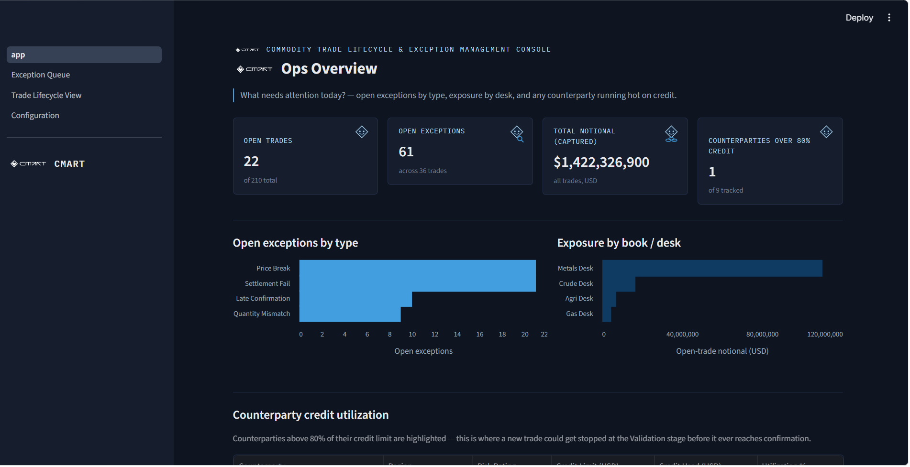
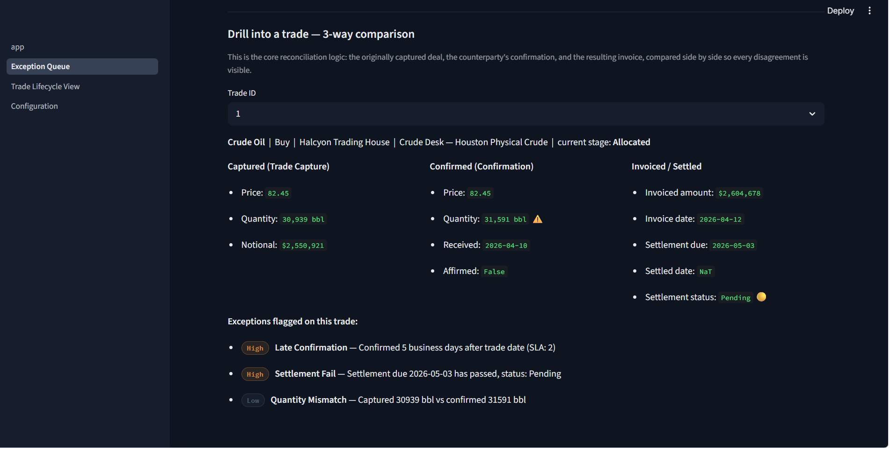
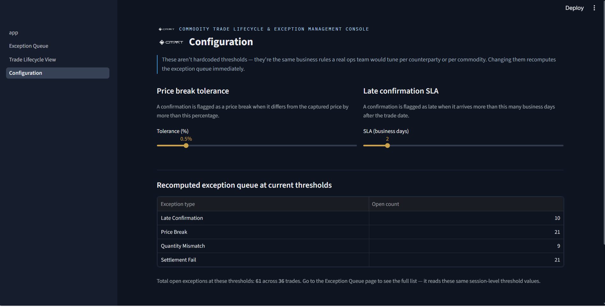

# Commodity Trade Lifecycle & Exception Management Console

A working model of how a physical commodity trade moves from capture through
settlement, and how an operations team catches the three things that most
commonly break along the way: price breaks, quantity mismatches, and
settlement fails — surfaced through 3-way matching between the captured
deal, the counterparty's confirmation, and the invoice.

**Live demo:** _add your deployed Streamlit Community Cloud / HuggingFace
Spaces link here after deployment_

---

## Why this exists

I don't have prior ETRM domain experience — I'm a CS + Business Systems
student who has built operational dashboards before (Streamlit, SQL,
Python), but I've never worked inside a real trading system like Endur,
Allegro, or RightAngle. This project is my attempt to actually understand
the operational logic of commodity trading — not just the vocabulary —
by modeling it from public domain knowledge: the seven-stage trade
lifecycle, and the 3-way matching discipline that ops teams use to catch
breaks before they become settlement failures. It's a simplified,
independent model built to demonstrate that I can pick up an unfamiliar
operational domain quickly and reason about where the real pain points
are, not a claim to have replicated any vendor platform or real trading
desk's actual logic.

## What is "3-way matching"?

When a physical commodity trade is booked, three separate records get
created at different points in time, by different systems and sometimes
different people: the trade as originally **captured** by the trader, the
**confirmation** the counterparty sends back affirming (or disputing) the
deal terms, and the **invoice** generated once delivery is confirmed. In a
perfect world all three agree. In practice they don't — a counterparty
confirms a different price, a quantity gets mis-keyed, a confirmation
shows up late. 3-way matching is the discipline of comparing all three
records against each other and surfacing every point of disagreement so
it can be resolved before cash is due to move. This console's Exception
Queue and drill-down view exist to make that comparison visible.

## Screenshots

_Screenshots go in a `screenshots/` folder at the repo root — add PNGs there and
uncomment the lines below (they're commented out for now since the files
don't exist yet, which is what was 404ing on GitHub)._


### Page 1 — Ops Overview


### Page 2 — Exception Queue (with 3-way match drill-down)


The drill-down at the bottom of this page is the core reconciliation view —
captured, confirmed, and invoiced data compared side by side for a single
trade, with the specific point of disagreement flagged:



### Page 3 — Trade Lifecycle View


### Page 4 — Configuration



## The trade lifecycle this models

1. **Trade Capture** — counterparty, commodity, quantity, price, delivery
   period, buy/sell direction
2. **Enrichment** — tagged with a book and profit centre
3. **Validation** — credit and limit checks against the counterparty
4. **Confirmation** — sent to the counterparty; this is where price breaks
   and quantity mismatches originate
5. **Allocation / Scheduling** — allocated to physical delivery
6. **Invoicing** — generated from the confirmed deal and delivery data
7. **Settlement** — cash/value exchanges hands; a missed date is a
   settlement fail

## Exception types detected

| Exception type | Detection rule |
|---|---|
| Price break | Confirmed price differs from captured price by more than a configurable tolerance |
| Quantity mismatch | Confirmed quantity ≠ captured quantity |
| Late confirmation | Confirmation received more than N business days after trade date (configurable) |
| Settlement fail | Settlement date has passed and the trade isn't Settled |

Every exception carries an **age** (days open), an **ownership tag** (book
and profit centre), and a **severity** tied to the dollar notional actually
at risk — a price break on a 50,000-barrel crude trade is treated very
differently from one on a 500-barrel trade.

## Tech stack

- **Streamlit** — 4-page app (Ops Overview, Exception Queue, Trade
  Lifecycle View, Configuration)
- **SQLite** — 4-table schema (`trades`, `counterparties`, `confirmations`,
  `invoices`); portable, no server required
- **pandas** — 3-way matching and exception detection logic
- **Altair** — bar charts (deliberately no gauges, speedometers, or icon-led
  KPI grids)

## Running it locally

```bash
pip install -r requirements.txt
python generate_data.py     # builds data/trade_lifecycle.db with synthetic data
streamlit run app.py
```

The app opens at `http://localhost:8501`. Page navigation is in the
sidebar.

## Synthetic data

150–250 trades were deliberately not enough — the data is generated with
hand-designed exception patterns rather than uniform random noise, so the
queue reads like a real ops backlog rather than randomly perturbed rows:
a small number of severe price breaks, a larger number of small aging
ones, a cluster of late confirmations concentrated on one specific
counterparty known to be slow, a handful of settlement fails, and exactly
one counterparty deliberately parked near its credit limit. See
`generate_data.py` for the exact injection logic.

## What I'd build next with more time

- **Position/exposure rollup by commodity** — net long/short position per
  commodity across all open trades, not just notional by book
- **VaR estimation on open positions** — even a simple parametric VaR
  using historical commodity price volatility would move this from a
  reconciliation tool toward a risk tool
- **Email-based confirmation ingestion simulation** — in real ops teams a
  meaningful share of confirmations still arrive as semi-structured PDFs
  or emails; simulating that ingestion and matching pipeline would be a
  much closer model of the actual daily workflow than the current
  structured-table assumption
- **Multi-currency settlement with FX exposure** — right now everything is
  modeled in USD; real ETRM books carry FX risk on top of commodity price
  risk, and that interaction is a real source of settlement breaks
- **Configurable quantity-mismatch tolerance and settlement grace period**
  — currently these two exception types are binary (any difference /
  any late date counts), whereas a production system would likely allow
  a small tolerance band on both, similar to the price break and SLA
  sliders already on the Configuration page

## Scope notes

This is a portfolio artifact, not a product — there's no authentication,
no multi-user support, and it isn't a clone of Endur, Allegro,
RightAngle, or any other vendor platform. All trade, counterparty, and
exception data is synthetic and generated for demonstration purposes.
